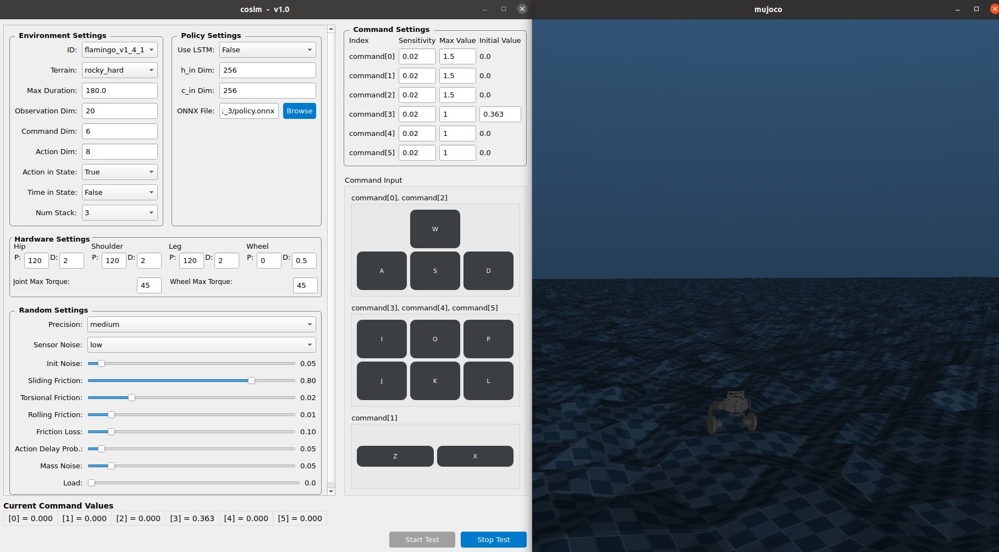
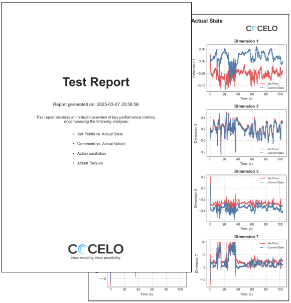

# cosim
**Sim-to-Sim Framework Using MuJoCo**  

## Overview  
<p align="center">
  
  
</p>

`cosim` is a **Sim-to-Sim Framework** built on the MuJoCo physics engine.  
It is designed for studying transitions between different simulation environments and evaluating model performance under various physical conditions.  

## Key Features  
- **🏎 MuJoCo-Powered Simulation** – High-performance, physics-based simulation for precise modeling  
- **🔄 Cross-Environment Transfer** – Enables transfer learning and comparison between different physical environments  
- **📊 Comprehensive Analysis Tools** – Generates detailed reports after simulation to facilitate policy and environment analysis  

This project focuses on **Sim-to-Sim transfer**, providing a robust framework for advanced simulation research.

## Installation  
Before running `cosim`, ensure you have the required dependencies installed.

1. **Create a Conda Virtual Environment (Python 3.10 recommended):**  
   ```sh
   conda create -n cosim python=3.10
   conda activate cosim

2. **Install Dependencies:** 
   ```sh
   pip install -r requirements.txt

2. **Run Simulator:** 
   ```sh
   python launch.py

